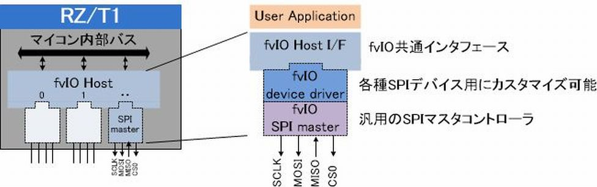

# fvio_rzt1_spi_cmn
fvio_rzt1_spi_cmnはfvIO技術を使用したSPIマスタのプラグイン(south plugin)です。プラグインは1スロット版と信号線の本数を拡張した2スロット版を用意しています。<br>
マイコン内蔵SPIインタフェースとは別に、最大8スロット(2スロット版では4スロット)分のSPI通信を実行することができます。<br>

fvIO(functions-virtualized Input/Output)とは、[シマフジ電機(株)](http://www.shimafuji.co.jp/)が開発した「マイコン/マイクロプロセッサが内蔵するI/O端子機能を仮想化する技術」であり、以下の特徴があります。<br>

- ソフトウェアによる通信プロトコル実装と比べて通信速度を高速化
- マイコンのCPU負荷の軽減
- FPGAと比較して開発コストが低い（マイコン単体で実現できるため）
- プラグインの組み合わせは自由
- 各プラグイン間の同期を数十ns単位で実現

<br>

# 目次
- [1.プラグイン機能](#1.プラグイン機能)<br>
- [2.動作環境](#2.動作環境)<br>
- [3.プラグインのインストール手順](#3.プラグインのインストール手順)<br>
- [4.使用方法](#4.動作環境)<br>
- [5.ライセンス](#5.ライセンス)<br>

# [1.プラグイン機能](#目次)
下記は基本機能になります。カスタマイズにより機能の拡張が可能です。
- SPIパケットの送受信(1パケットあたりの最大通信長は8byte)
- 通信速度設定は約40kbit/s～10Mbit/sまで可能
- 同一パケットのリピート転送
- DMAを利用したパケットの連続転送
- 外部同期信号によるプラグイン間の同期

# [2.動作環境](#目次)

## 2.1 対応ボード
fvio_rzt1_spi_cmnはルネサス エレクトロニクス（以下ルネサス）製マイクロプロセッサ「[RZ/T1](https://www.renesas.com/jp/ja/products/microcontrollers-microprocessors/rz/rzt/rzt1.html)」上でのみ動作します。現在対応しているボードは以下になります。

- [SEMB1401(IoT-Engine RZ/T1)](http://www.shimafuji.co.jp/products/941)

## 2.2 対応デバイス
fvio_rzt1_spi_cmnの現在対応しているデバイスは以下になります。
- [SPI通信用 OLED LCDディスプレイ(SSD1306)](http://www.solomon-systech.com/en/product/advanced-display/oled-display-driver-ic/ssd1306/)
- [6軸加速度センサ(MPU6500)](https://www.invensense.com/products/motion-tracking/6-axis/mpu-6500/)

# [3.ビルド手順](#目次)

## 3.1 ビルド環境
ビルドには以下のツールが必要です。
- [KPIT GNUARM-NONE v16.01](https://gcc-renesas.com/ja/rz/rz-download-toolchains/)
- [e2studio ver.7.3.0](https://www.renesas.com/jp/ja/products/software-tools/tools/ide/e2studio.html)

## 3.2 ベースプログラム

fvio_rzt1_spi_cmnは以下のルネサス製のRZ/T1サンプルプログラムに組み込む形で動作します。ビルドを実行する前に[ルネサスのHP](https://www.renesas.com/jp/ja/products/microcontrollers-microprocessors/rz/rzt/rzt1.html)で必要なサンプルプログラムをダウンロードして下さい。

| ファイル名 | 概要 |
|:------------|:------------|
| an-r01an2554jj0141-rzt1-initial-settings.zip | RZ/T1グループ 初期設定(ベースプログラム) |
| an-r01an3569jj0200-rzt1-encoder.zip | RZ/T1 Encoder I/F（ライブラリ) |

## 3.3 ファイル追加
リポジトリから取得したファイルをルネサス製のサンプルプログラム(an-r01an2554jj0141-rzt1-initial-settings)に対して以下のように追加して下さい。

★:fvio_rzt1_spi_cmnから追加<br>
◎:an-r01an3569jj0200-rzt1-encoderから追加<br>

RZ_T_sflash_sample/(※1)<br>
　　　　┣inc/<br>
　　　　┃  ┗◎r_ecl_rzt1_if.h<br>
　　　　┃<br>
　　　　┣★lib/<br>
　　　　┃  ┗ ★ecl/<br>
　　　　┃  　┣ ◎r_ecl_rzt1.a<br>
　　　　┃  　┣ ★s_fvIO_rzt1_comn_spi_0.dat<br>
　　　　┃  　┣ ★s_fvIO_rzt1_comn_spi_1.dat<br>
　　　　┃  　┣ ★s_fvIO_rzt1_comn_spi_2.dat<br>
　　　　┃  　┣ ★s_fvIO_rzt1_comn_spi_3.dat<br>
　　　　┃  　┣ ★s_fvIO_rzt1_comn_spi_4.dat<br>
　　　　┃  　┣ ★s_fvIO_rzt1_comn_spi_5.dat<br>
　　　　┃  　┣ ★s_fvIO_rzt1_comn_spi_6.dat<br>
　　　　┃  　┣ ★s_fvIO_rzt1_comn_spi_7.dat<br>
　　　　┃  　┣ ★s_fvIO_rzt1_comn_spi_01.dat<br>
　　　　┃  　┣ ★s_fvIO_rzt1_comn_spi_23.dat<br>
　　　　┃  　┣ ★s_fvIO_rzt1_comn_spi_45.dat<br>
　　　　┃  　┗ ★s_fvIO_rzt1_comn_spi_67.dat<br>
　　　　┗src/<br>
　　　　　 ┣★fvio/<br>
　　　　　 ┃   ┣ ★dev_driver/(※2)<br>
　　　　　 ┃   ┃          ┣ ★mpu6500/<br>
　　　　　 ┃   ┃          ┃　　　　┣★fvIO_rzt1_spi_mpu6500.c<br>
　　　　　 ┃   ┃          ┃　　　　┗★fvIO_rzt1_spi_mpu6500.h<br>
　　　　　 ┃   ┃	      ┗ ★ssd1306/<br>
　　　　　 ┃   ┃          　　　　　┣★fvIO_rzt1_spi_ssd1306.c<br>
　　　　　 ┃   ┃          　　　　　┗★fvIO_rzt1_spi_ssd1306.h<br>
　　　　　 ┃   ┣ ★fvio_driver/<br>
　　　　　 ┃   ┃          ┣ ★fvIO_cmn_if.h<br>
　　　　　 ┃   ┃          ┣ ★fvIO_cmn_2s_if.h<br>
　　　　　 ┃   ┃          ┣ ★fvIO_rzt1_dma.c<br>
　　　　　 ┃   ┃          ┣ ★fvIO_rzt1_dma.h<br>
　　　　　 ┃   ┃          ┣ ★fvIO_rzt1_spi_cmn.c<br>
　　　　　 ┃   ┃          ┣ ★fvIO_rzt1_spi_cmn.h<br>
　　　　　 ┃   ┃          ┣ ★fvIO_rzt1_spi_cmn_2s.c<br>
　　　　　 ┃   ┃          ┣ ★fvIO_rzt1_spi_cmn_2s.h<br>
　　　　　 ┃   ┃          ┗ ★fvIO_dat.asm<br>
　　　　　 ┃   ┃<br>
　　　　　 ┃   ┗ ★fvio_if/<br>
　　　　　 ┃               ┣ ★fvIO_if.c<br>
　　　　　 ┃               ┗ ★fvIO_if.h<br>
　　　　　 ┃<br>
　　　　　 ┗sample/<br>
　　　　　  　 ┣★main.c(※3)<br>
　　　　　  　 ┣★utility.c<br>
　　　　　  　 ┗★utility.h

※1 RZ_T_ram_sampleでも同様の追加を行います。<br>
※2 リポジトリのdev_driver内の必要なディレクトリを追加します。<br>
※3 リポジトリのサンプルプログラムを使用するかは任意です。<br>

## 3.4 ファイル修正
SEMB1401を使用する場合、src/common/sflash_boot/spibsc_ioset_userdef.cに以下の修正が必要です。

修正前:<br>
```
#define SPIBSC_BUS_WITDH    (4)
#define SPIBSC_OUTPUT_ADDR  (SPIBSC_OUTPUT_ADDR_32)
```

修正後:<br>
```
#define SPIBSC_BUS_WITDH    (1)
#define SPIBSC_OUTPUT_ADDR  (SPIBSC_OUTPUT_ADDR_24)
```

## 3.5 ビルド
プロジェクトのプロパティで以下のように修正してからビルドを実行します。

（１）Target Processor<br>
<br>

（２）Cross ARM C Compiler/Includes<br>
～/src/fvio/dev_driver以下のパス設定は、ユーザーが組み込んだ任意のディレクトリ名を入力します。

<br>

（３）Cross ARM C Linker/Other<br>
<br>

# [4.使用方法](#目次)
各種プラグインでは共通して以下のI/F関数を提供しています。

| I/F関数 | 概要 |
|:------------|:------------|		
| fvio_sys_init | プラグイン内部で使用する変数やモジュール等の初期化を行う。|		
| fvio_entry | プラグインを登録する。 |
| fvio_release | プラグイン登録を削除する。|
| fvio_assign | プラグインとスロットの紐づけを行う。|
| fvio_unassign | プラグインとスロットの紐づけを解除する。|			
| fvio_sys_start | プラグインを紐づけたスロットにロードし、fvIOを一斉に起動する。(全fvIOスロットは同時に起動)|
| fvio_stop | fvIOを停止する。(スロット毎に可能) |
| fvio_write | fvIOに対してライト制御を実行。(プラグイン内部の設定に対しても可能)	|
| fvio_read	 | fvIOに対してリード制御を実行。(プラグイン内部の設定に対しても可能)	|

基本的な使用方法としては、以下の順にI/F関数をコールし、デバイスを制御します。詳細については、プラグインのアプリケーションノートを参照して下さい。

1.fvio_sys_initでプラグインを初期化<br>
2.fvio_entryでプラグインを登録<br>
3.fvio_assignでプラグインをスロットにアサイン<br>
4.fvio_sys_startで全スロットのfvIOを起動<br>
5.fvio_write/fvio_readを使用して各スロットのデバイスを制御<br>

# [5.ライセンス](#目次)
[MITライセンス](LICENSE)
